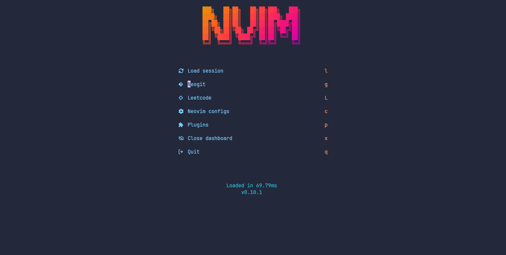

# nvim

## Requirements
- [figlet](https://github.com/cmatsuoka/figlet) Generate Dashboard text
- [lolcat](https://github.com/busyloop/lolcat) Dashboard rainbow colorizer
## Quick start
Install neovim with [bob](https://github.com/MordechaiHadad/bob)
```sh
bob use latest
```
Clone repo to configs
```sh
git clone https://github.com/spreadprism ~/.config/nvim
```
Start neovim
```
nvim
```
